<p align="center">
  
</p>

Eight dark themes for VS Code inspired by a century of cinema. From the silver screen to your editor.

[Deep](#deep) ·
[Kodachrome](#kodachrome) ·
[Marquee](#marquee) ·
[Neon](#neon) ·
[Drive-In](#drive-in) ·
[Warm](#warm) ·
[Psychedelic](#psychedelic) ·
[Silent Era](#silent-era)

## Themes

### Deep

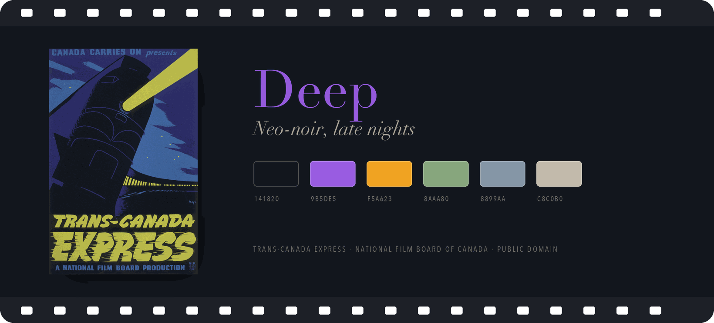

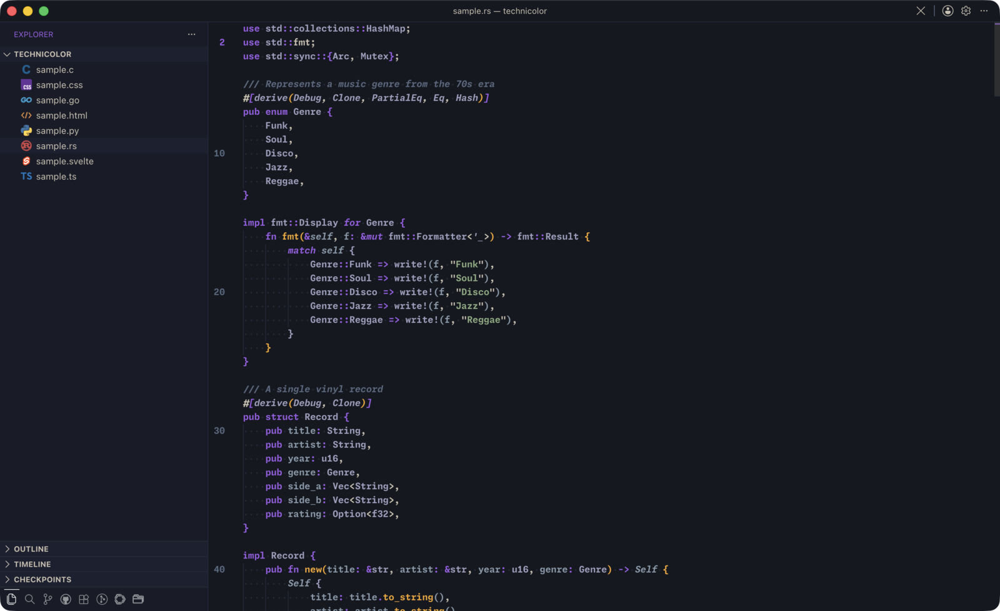

### Kodachrome

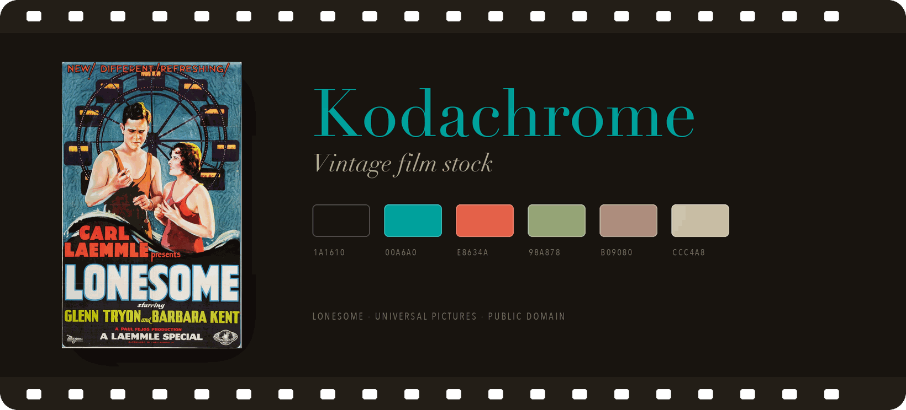

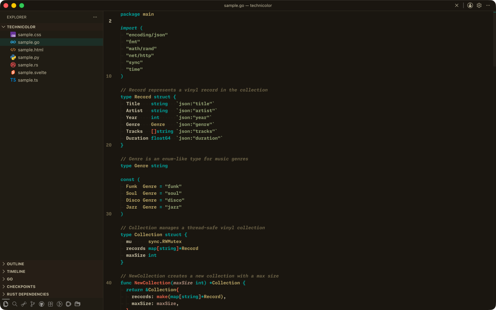

### Marquee

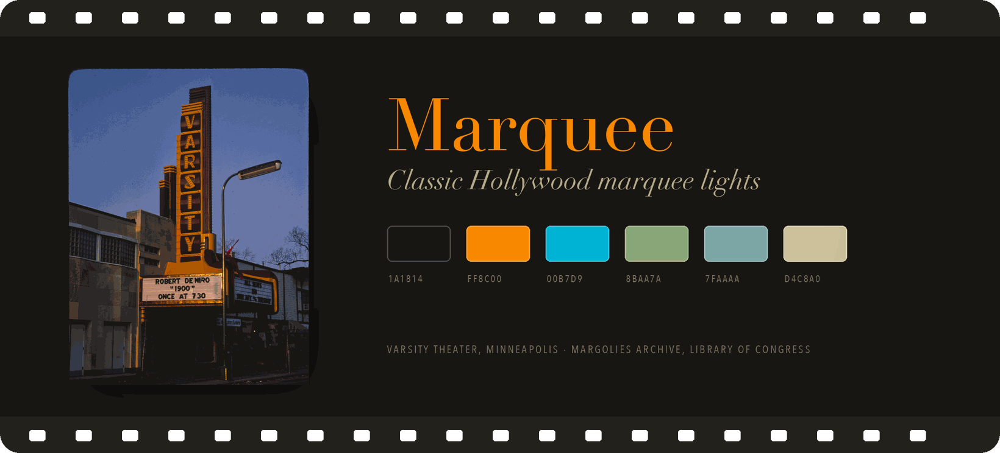

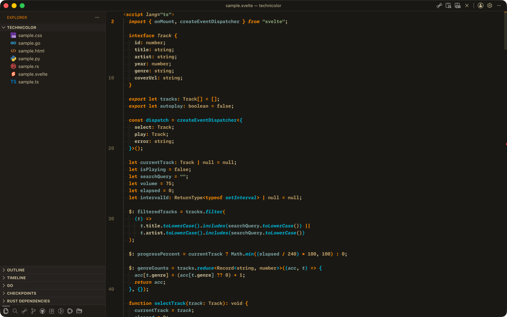

### Neon

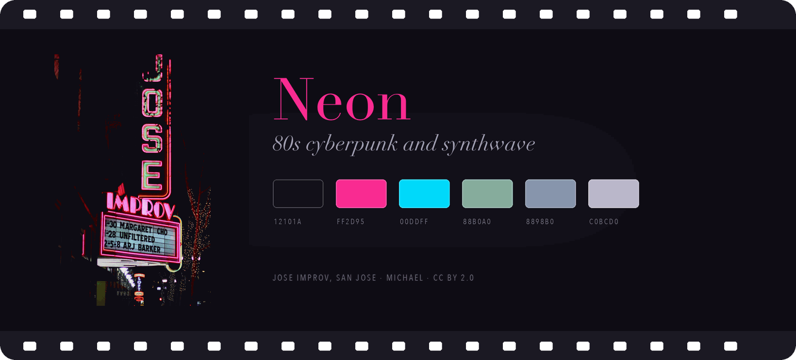

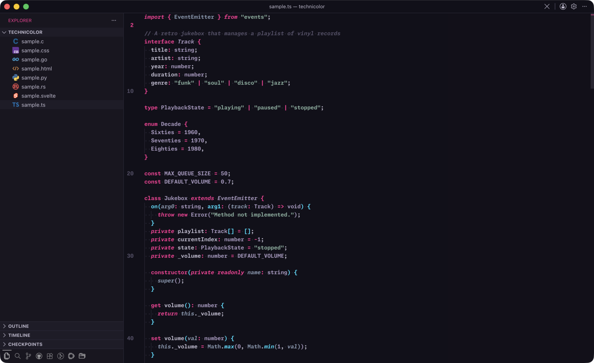

### Drive-In

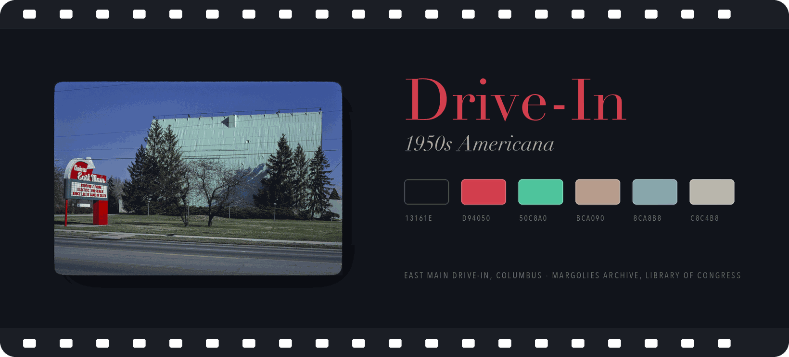

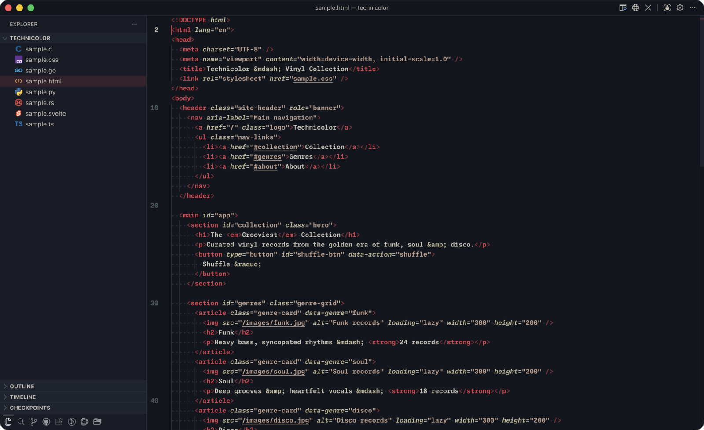

### Warm

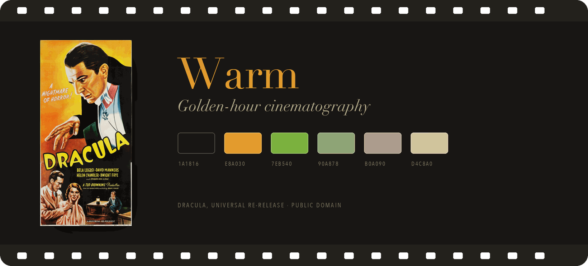

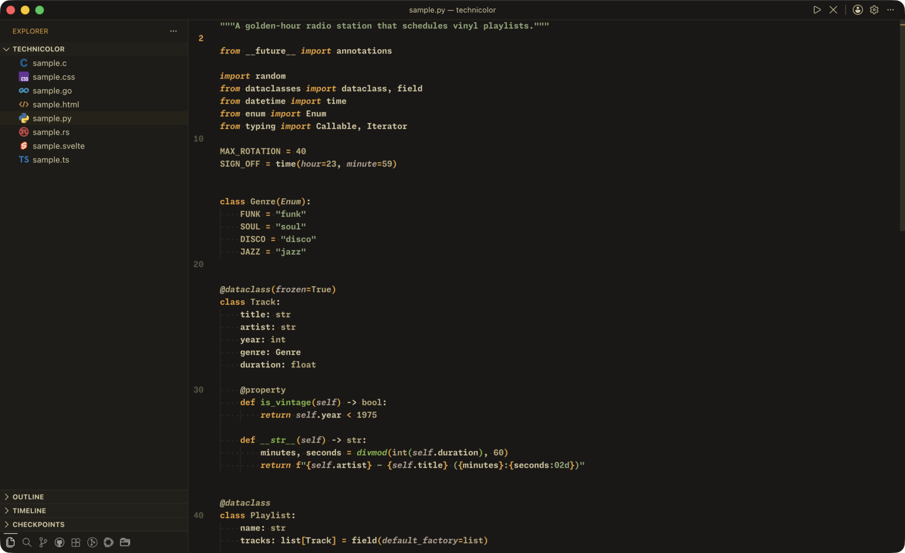

### Psychedelic

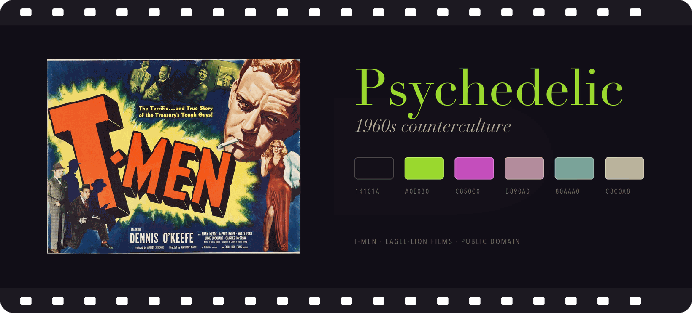

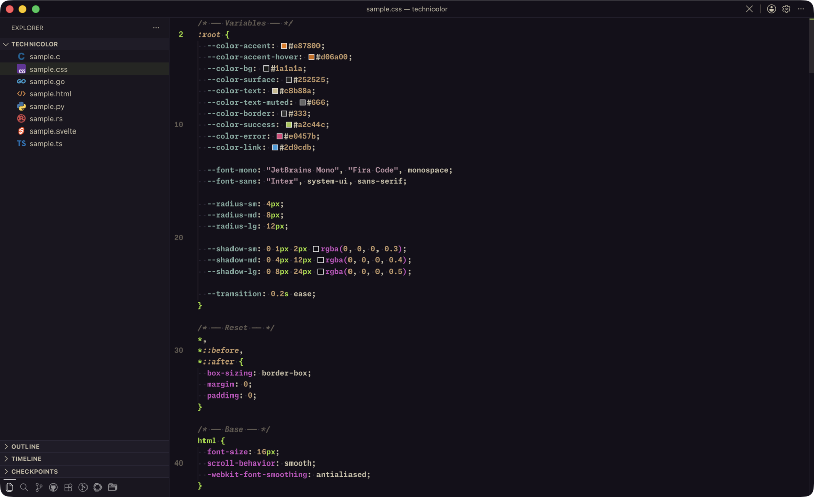

### Silent Era

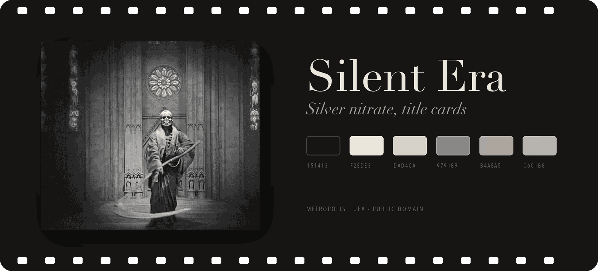

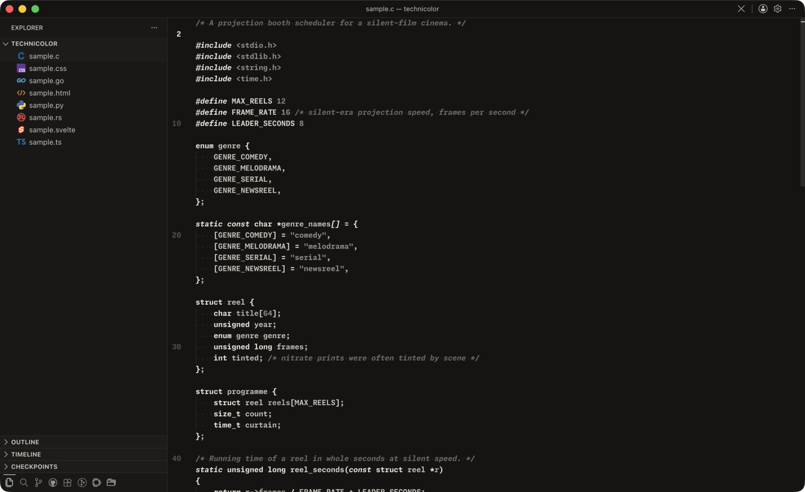

## Installation

Install from the
[Visual Studio Marketplace](https://marketplace.visualstudio.com/items?itemName=oppositefish.technicolor),
or search for "Technicolor" in the Extensions view (⇧⌘X).

Then open **Preferences: Color Theme** and pick a variant.

### Building from source

```
git clone https://github.com/JazzJackrabbit/technicolor-vscode.git
cd technicolor-vscode
npx @vscode/vsce package
code --install-extension technicolor-*.vsix
```

## License

MIT © Kirill Ragozin
